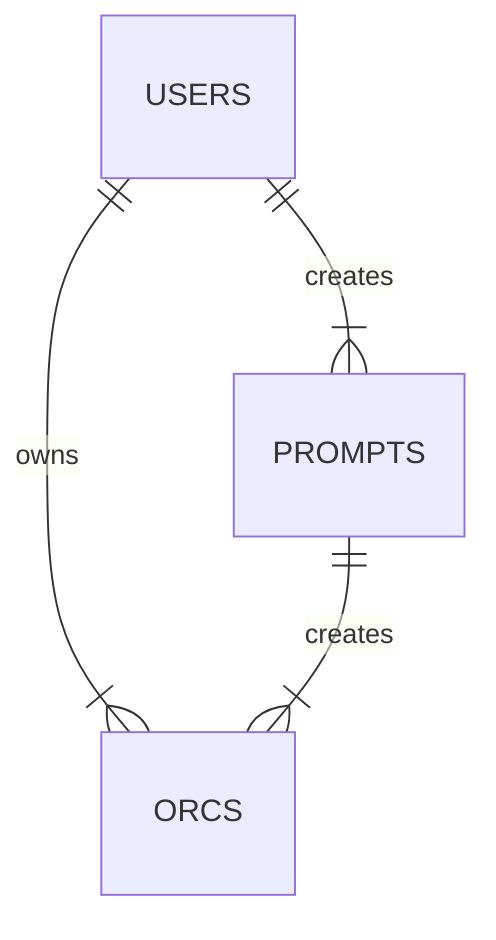

# Create An Orc project

This website provides a randomised name, stats, an description built from a prompt and a visual
picture of your character made from randomised pieces of pixel character art. This fantasy character will be an `orc`
which will be communicated in the branding of the site.
The generation of a short description of the character will be done through prompts to OpenAI.
The randomised character will be regenerated on a page refresh. This is to quickly give a user
seeking an idea for art or writing a compelling starting off point.

## Problem Definition
Creating a new character for a series or for a TTRPG can sometimes be a daunting process if people are
experiencing a creative block.
This project intends to provide a compelling starting off point to encourage user ideas and creativity.
The design will focus on accessibility and speed to get creatives thinking with minimal effort, but will be
able to eventually include some more incentives for repeat users like saving and sharing their
favourite random prompts.

## Who is it for?
This project is designed to provide a creative prompt for writers/artists/ttrpg players or anyone seeking a
prompt to form an idea for a fantasy character. In this case, characters are also referred to as Orcs in the system.

## MOSCOW analysis

### Must have
- A pixel art image of the randomised orc. This has been created through:
    - A shadow base
    - A face with skin colour
    - Upper torso clothes
    - Lower torso clothes
- These individual images are layered together on the screen and will appear in the same place on page refresh
- A randomised name which has been built out of syllables provided in a JSON file.
- A randomised description created via prompts to Open AI. The prompts should have randomised values each time it is sent
  through to the AI. The AI generates the description which will be sent back and displayed.
- Randomised Stats for the character.
### Should have
- User accounts where a user can save instances of characters that they wish to keep record of.
- Rate limiting to prevent an overload of AI requests.
- The website should be viewable and usable on different screen sizes.
### Could have
- Eventually expand to other kinds of fantasy characters, like elves, dwarves etc. Each new type of potential character
  will need to be added as separate updates.
- Users can share their favourite creations with other users.
### Won't have
- A full gameified character sheet for ttrpg players as this would be too complex.
- A massively expanded description of the orc as this is just meant to be a simple prompt to inspire user
  creativity.

## Domain Model Diagram


## Dictionary
- **User**: Any person accessing the website and viewing a randomised character
- **Orc**: The user generated character that are returned via the randomiser code and the AI. Initially this is just for Orcs as a race.
- **Prompt**: Randomised adjectives that will be provided in threes to the AI to generate a
  character. For example an orc may be:
    - Adventurous
    - Poor
    - Good
- **Catalogue**: Syllables stored within the databases used for the purpose of orc name generation and supplementing prompts with Retrieval Augemented Generation (RAG).

---

## Entity Relationship Diagram
```mermaid
erDiagram
direction TB
USERS {
	id int PK
	user_name string
	email_address string
	user_password string
	available_tokens int
	role Role
	profile_id 
}
USER_PROFILE {
    id int PK
}
PROMPTS {
 	id int PK
	adjectives text
}
PROMPTS_COLLECTION {
	id int PK
	prompt1 int FK
	prompt2 int FK
	prompt3 int FK
}
ORCS {
 	id int PK
	name string
	orc_images_id int FK
	prompts_collection_id int FK
	user_id int FK
}
ORC_IMAGES {
	id int PK
	head int FK
	torso int FK
	legs int FK
}
ORC_HEAD {
	id int
	url text 
}
ORC_TORSO {
	id int
	url text 
}
ORC_LEGS {
	id int
	url text 
}
BACKGROUND_IMAGES {
 	id int PK
	image_name string
	url string
}
ORC_CATALOGUE {
	id int PK
	orc_id int FK
	catalogue_id int FK
}
CATALOGUE {
    id int PK
    syllables string
}
	USERS ||--|{ PROMPTS_COLLECTION : creates
	USERS ||--|{ ORCS : owns
	USERS ||--|| USER PROFILE : owns
	ORCS ||--|{ PROMPTS_COLLECTION : uses
	ORCS ||--|| CHARACTER_IMAGES : has
	ORCS ||--|| CATALOGUE : uses
	ORC_IMAGES ||--|{ CHARACTER_BODY_PART_IMAGES : uses
	ORC_BODY_PART_IMAGES }|--|{ CHARACTER_BODY_PART_IMAGE_TYPES : uses
	ORC_CATALOGUE ||--|{ CHARACTERS : generates
	PROMPTS_COLLECTION ||--|{ PROMPTS : uses
	
```

# APIs


## Users


## Users GET requests

## GET /users

Description: Get all users.

Response codes:

200 OK\
404 Not Found

Response Example
```
[
  {
    "id": 1,
    "user_name": "testadmin",
    "email_address": "adminaccount@example.com",
  },
  {
    "id": 2,
    "user_name": "testuser",
    "email_address": "testaccount@example.com",
  }
]
```

### GET /users/{id}

Description: Get a single user by ID

Response codes:

200 OK\
404 Not Found

Response Example
```
  {
    "id": 1,
    "user_name": "testadmin",
    "email_address": "adminaccount@example.com",
}
```

---
## Users POST requests

### POST /users

Description: Register an account for a new user.

Request Example:
```
{
  "user_name": "newUser",
  "email_address": "new_user@example.com,
  "user_password": "encryptedPassword",
  "admin_privileges": 0
}
```

Response codes:

200 OK\
201 Created\
400 Bad Request

Response Example:
```
{
  "id": 3,
  "user_name": "newUser",
  "email_address": "new_user@example.com",
  "admin_privileges": 0,
  "profile_id": 3
}
```

---
## Users PUT requests

### PUT users/{id}

Description: Update a single user account.

Request Example:
```
{
  "user_name": "new_user",
  "admin_privileges": 0
}
```

Response codes:

200 OK\
201 Created\
400 Bad Request

```
Response Example:

{
  "id": 3,
  "user_name": "updated_new_user",
  "email_address": "updated_email@example.com",
}
```

---
## Users DELETE requests

### DELETE users/{id}

Description: Delete a single user account.

Request Example:
```
{
  "user_name": "deletedUser",
  "email_address": "deleted_user@example.com,
  "user_password": "encryptedPassword",
  "admin_privileges": 0
}
```

Response codes:

204 Resource deleted successfully\
404 Not found

---

## Orcs


## Orcs GET requests

### GET "/orcs"

Description: Get all created Orcs saved in the database.

Response codes:

200 OK\
404 Not Found

Response Example
```
[
  {
    "id": 1,
    "name": "testOrc1",
    "prompts_collection_id": 1,
    "orc_images_id": 1,
    "user_id": 1
  },
    {
    "id": 2,
    "name": "testOrc2",
    "prompts_collection_id": 2,
    "orc_images_id": 2,
    "user_id": 1
  },
    {
    "id": 3,
    "name": "testOrc3",
    "prompts_collection_id": 3,
    "orc_images_id": 3,
    "user_id": 2
  },
]
```

### GET "/users/{user_id}/orcs"

Description: Get all Orcs saved to a user.

Response codes:

200 OK\
404 Not Found

Response Example
```
[
  {
    "id": 1,
    "name": "testOrc1",
    "prompts_collection_id": 1,
    "orc_images_id": 1,
    "user_id": 1
  },
  {
    "id": 2,
    "name": "testOrc2",
    "prompts_collection_id": 2,
    "orc_images_id": 2,
    "user_id": 1
  }
]
```


### GET "/orcs/{id}"

Description: Get an Orc by the id.

Response codes:

200 OK\
404 Not Found

Response Example
```
[
  {
    "id": 1,
    "name": "testOrc1",
    "prompts_collection_id": 1,
    "orc_images_id": 1,
    "user_id": 1
  }
]
```

---
## Orcs POST requests

### POST /users/{user_id}/orcs

Description: Saves a new Orc for a user.

Request Example:
```
  {
    "name": "testOrc3",
    "prompts_collection_id": 3,
    "orc_images_id": 3,
    "user_id": 3
  },
```

Response codes:

200 OK\
201 Created\
400 Bad Request

Response Example:
```
{
  "id": 3,
  "name": "testOrc3",
  "prompts_collection_id": 3,
  "orc_images_id": 3,
  "user_id": 3
}
```

---

## Orcs PUT requests

Once new objects are posted into the Orcs database they shouldn't be updated or changed.

---

## Orcs DELETE requests

### DELETE /orcs/{orc_id}

Description: Delete a saved Orc from a user collection.

Request Example:
```
{
  "id": 1,
  "name": "testOrc1",
  "prompts_collection_id": 1,
  "orc_images_id": 1,
  "user_id": 1
}
```

Response codes:

204 Resource deleted successfully\
404 Not found

---

## Prompts GET requests

## GET /prompts

Description: Get all prompts.

Response codes:

200 OK\
404 Not Found

Response Example
```
[
  {
    "id": 1,
    "adjectives: "good"
  },
  {
    "id": 2,
    "adjectives" : "evil"
  }
]
```

## GET /prompts/{id}

Description: Get a single prompt by id.

Response codes:

200 OK\
404 Not Found

Response Example
```
  {
    "id": 3,
    "adjectives: "neutral"
  }
```
---
## Prompts POST requests

### POST /prompts

Description: Submit a new prompt to the database.

Request Example:
```
{
  "adjectives" : "happy"
}
```

OR

```
[
  {
    "adjectives": "sad"
  },
  {
    "adjectives": "angry"
  }
]
```

Response codes:

200 OK\
201 Created\
400 Bad Request

---
## Prompts PUT requests

### PUT prompts/{id}

Description: Update a prompt by id.

Request Example:
```
{
  "id": 5,
  "adjectives": "prompt_to_update"
}
```

Response codes:

200 OK\
201 Created\
400 Bad Request

```
Response Example:

{
  "id": 5",
  "adjectives" : "prompt_to_update"
}
```

---
## Prompts DELETE requests

### DELETE prompts/{id}

Description: Delete a single prompt by id.

Request Example:
```
{
  "id": "6",
  "adjectives" : "delete_this_prompt"
}
```

Response codes:

204 Resource deleted successfully\
404 Not found

---
